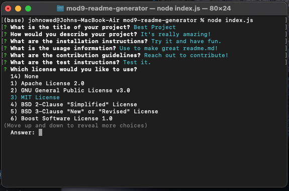

# README.md Generator

## Description
This README.md Generator helps users create a high quality README.md file by asking a series of questions to populate the content. It's easy to use and includes useful license badging.

## Table of Contents
- [Usage](#usage)
- [Credits](#credits)
- [Features](#features)
- [Access](#access)

## Usage
- Run the application by using the following command:
```bash
node index.js
```
- Answer the questions about your project.
- Find the README.md file with all your responses.



## Credits
Pulled source code from [here](https://github.com/coding-boot-camp/potential-enigma), as well as used examples from our Week 9 learnings.

## Features
- Select license to get badging icon added to your readme!
- No License will leave the license section blank

## Access
Click to view repository: [README.md Generator](https://github.com/johnpow/professional-readme-generator).